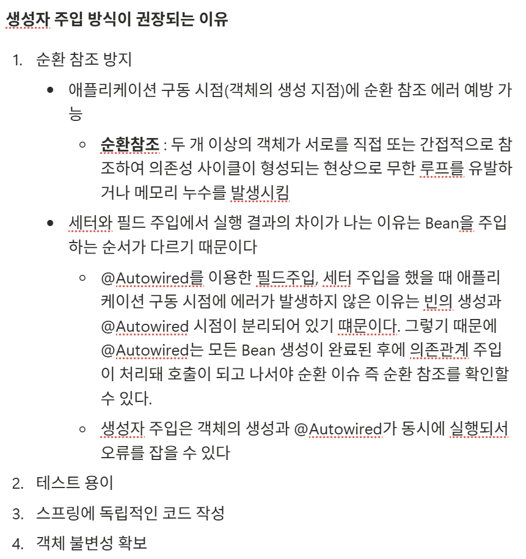

### 피어리뷰(주니꺼)

생성자 주입 방식이 권장되는 이유 중 순환 참조 방지를 잘 이해할 수 있었습니다!
---

- **SOLID원칙이란?**
    
    **객체 지향 설계의 5원칙 (SOLID)**
    
    - SRP (Single Responsibility principle)
        - **단일 책임 원칙**
        - 클래스(객체)는 단 하나의 책임(기능)만 가져야 한다.
    - OCP (Open Closed Principle)
        - **개방 폐쇄 원칙**
        - 확장에는 열려있어야 하며, 수정에는 닫혀있어야 한다.
        - 새로운 변경 사항 발생 시 유연하게 코드 추가가 가능하지만, 객체를 직접적으로 수정하는 것은 제한함
    - LSP (Liskov Substitution Principle
        - **리스코프 치환 원칙**
        - 서브 타입은 언제나 부모 타입으로 교체할 수 있어야 한다.
        - 다형성 원리를 이용하기 위한 원칙
        - 업캐스팅된 상태에서 부모의 메서드를 사용해도 동작이 의도대로 흘러가야 한다.
    - ISP (Interface Segregation Principle)
        - **인터페이스 분리 원칙**
        - 인터페이스를 각각 사용에 맞게 잘게 분리
        - 인터페이스 단일 책임
    - DIP (Dependency Inversion Principle)
        - **의존 역전 원칙**
        - 구현 클래스에  의존하지 말고, 인터페이스에 의존
        - 변화하기 쉬운 것 보다는, 변화하기 어려운 것에 의존
        - 각 클래스간의 결합도 낮추기
- **DI란?**
    
    **의존성 주입 (Dependency Injection)**
    
    객체가 필요한 의존 객체를 직접 생성하지 않고, 외부에서 주입받는 디자인 패턴이다.
    
    **장점**
    
    - 코드 단순화
    - 모듈간 결합도를 낮추고, 유연성을 향상시킨다.
    - 재사용성을 높인다.
- **IoC란?**
    
    **제어의 역전 (Inversion of Control)**
    
    객체의 생성, 생명주기 관리까지 모든 객체에 대한 제어를 직접하는 것이 아니라 외부에서 관리하는 것.
    
    DI는 IoC를 실현하기 위한 방법!
    
- **생성자 주입 vs 수정자, 필드 주입 차이는?**
    1. **생성자 주입** → 가장 좋음
        
        객체가 생성될 때 딱 한 번만 호출되는 생성자를 통해 의존성을 주입
        
        의존성 관계가 변하지 않는 **불변성**을 보장한다.
        
    2. **수정자 주입 (Setter Injection)**
        
        setXxx() 메소드를 통해 의존성을 주입
        
        선택적이거나 변경 가능성이 있는 의존성에 사용한다.
        
    3. **필드 주입**
        
        필드에 직접 `@Autowired` 를 붙혀서 의존성을 주입한다.
        
        프레임워크 없이는 외부에서 변경이 불가능하여 테스트가 어렵다.
        
        스프링 컨테이너가 없으면 해당 객체를 사용할 수 없는 강한 결합이다.
        
- **AOP란?**
    
    **관점 지향 프로그래밍 :** 어떤 로직을 기준으로, 관점에 따라 공통 기능을 분리하여 모듈화하는 프로그래밍
    
    코드 여러 곳에 반복되는 코드를 모듈화하여, 핵심적인 비지니스 로직에서 분리하여 재사용!
    
    **AOP 핵심 개념**
    
    - Aspect (관점) : 여러 곳에 재사용되는 공통 기능을 모듈화 한 것
    - Target : Aspect를 적용하는 곳
    - Advice : 실질적으로 어떤 일을 언제 해야 할 지에 대한, 실질적인 부가 기능을 정의
    - JointPoint : Advice가 적용될 수 있는 지점 (주로 메소드 호출 시점)
    - Pointcut : 구체적 지점으로 JoinPoint 중 실제로 Aspect를 적용할 범위를 나타내는 것으로 더 구체적인 Advice가 실행될 지점을 정함
    
    AOP 동작 방식이 프록시이다.
    
- **프록시 패턴**
    
    어떤 객체를 사용할 때, 그 객체에 직접 접근하는 것이 아니라, **대신 처리하게 함**으로써 흐름을 제어하는 행동 패턴이다.
    
    프록시는 대리인으로, 실제 객체를 호출하기 전이나 후에 필요한 추가 로직을 수행할 수 있도록 해준다.
    
    **장점** : 보안, 캐싱, 데이터 유효성 검사, 지연 초기화, 로깅, 원격 객체
    
    **구조**
    
    - Subject : Proxy와 RealSubject를 하나로 묶는 인터페이스
    - RealSubject : 원본 대상 객체
    - Proxy : RealSubject를 중계할 대리자 역할
        - 프록시는 대상 객체와 같은 이름의 메서드를 호출하며, 별도의 로직을 수행할 수 있다.
        - 프록시는 흐름제어만 할 뿐 결과값을 조작하거나 변경시키면 안 된다.
    
    **패턴 종류**
    
    - 가상 프록시
        - 지연 초기화 방식
        - 리소스가 많이 드는 객체(무거운 DB 연결)의 생성을 지연시키고, 호출이 오면 그때 실제 객체를 생성하여 전달
    - 보호 프록시
        - 프록시가 대상 객체에 대한 자원으로의 접근을 제어
        - 권한이 있는 경우에만 실제 객체의 메서드를 호출
    - 원격 프록시
        - 다른 주소 공간(다른 서버)에 있는 객체에 접근할 때 사용
        - 네트워크 통신 처리를 프록시가 대신 해준다.
    - 로깅 프록시
        - 대상 객체에 대한 로깅을 추가하여 재정의
- **서블릿이란?**
    
    클라이언트의 요청에 대해 그 결과를 다시 전송해주는 자바 프로그램. 웹 페이지를 동적으로 생성해준다.
    
    요청을 해석해서 DB에서 데이터를 가져오거나 비지니스 로직을 수행한 뒤, JSON과 같은 응답을 생성한다.
    
    스프링에서는 `DispatcherServlet` 이 모든 요청을 받아서 비지니스 로직을 뿌려준다.