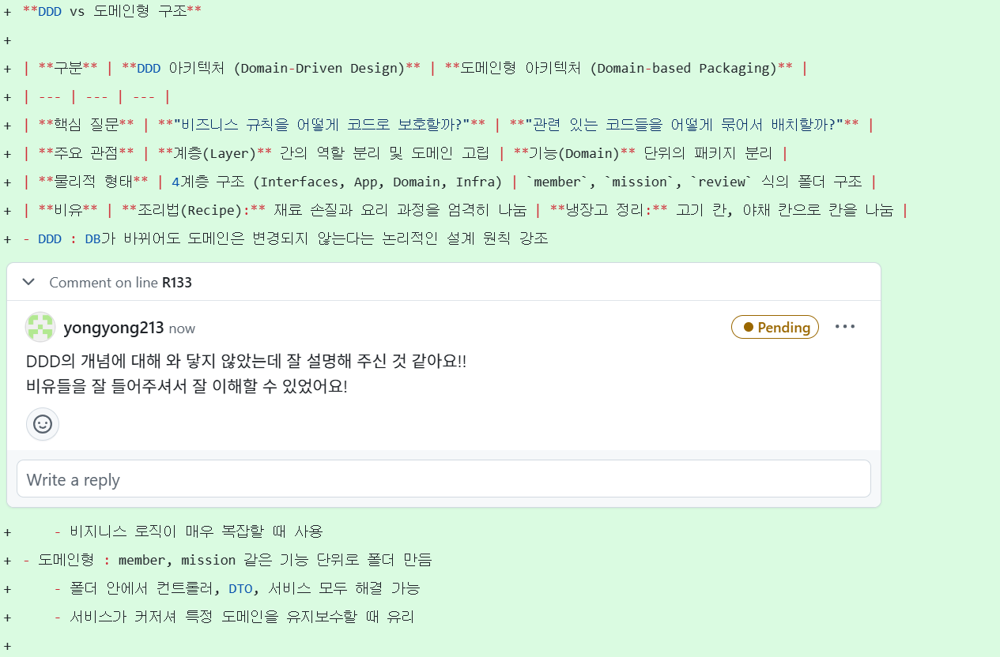

피어리뷰 (주니)

---
- 아키텍처 구조란?
    
    **시스템의 전체적인 설계도**이다.
    
    아키텍처 구조를 잘 잡음으로써 유지보수, 확장성, 분업을 잘 할 수 있게 된다.
    
    스프링에서는 대부분 계층형 아키텍처를 표준으로 사용한다고 함.
    
    계층형 아키텍처
    
    - Presentation Layer (controller)
        - 사용자의 요청을 받아서 처리한 후 응답을 반환해 줌
    - Service Layer (service)
        - 컨트롤러와 레포지토리를 연결하는 역할로 요청을 처리하기 위해서 비지니스 로직을 처리함
        - 데이터 가공 및 복잡한 계산
        - 트랜잭션 관리
    - Data Access Layer (repository)
        - DB와 상호작용을 처리하는 역할
        - SQL 쿼리 실행
        - JPA를 통해 DB 접근
----

- Swagger란?
    
    REST API를 편리하게 문서화하고, API 호출, 테스트까지 할 수 있게 도와주는 오픈소스 프레임워크이다.
    
    코드의 어노테이션을 분석해 API를 자동으로 문서화해주고, API 호출 테스트까지 해볼 수 있다. 
    
----

- 도메인형 아키텍처란?
    
    비지니스 로직에 중점을 둔 아키텍처로 도메인 중심으로 코드를 작성한다.
    
    ```bnf
    app
    ├── user (사용자 도메인)
    │   ├── UserController
    │   ├── UserService
    │   ├── UserRepository
    │   └── User
    └── product (미션 도메인)
        ├── MissionController
        ├── MissionService
        ├── MissionRepository
        └── Mission
    ```
    
    **장점**
    
    - 비지니스 로직이 명확하게 드러남
    - 새로운 기능 추가 시 독립적으로 추가할 수 있다.
    - 한 도메인의 변경이 다른 도메인에 영향을 미치지 않는다.
    
    **단점**
    
    - 도메인 간의 의존성 관리가 어렵다.
    - 작은 크기에 프로젝트에는 불필요하게 복잡할 수 있다.
----

- DDD vs 도메인형 아키텍처
    
    **DDD (도메인 주도 설계)**
    
    - 기획자랑 개발자가 같은 이해를 바탕으로 소프트웨어를 만드는 방법론
    
    장점
    
    - 비지니스 로직을 확실하게 나눈다.
    - 유지보수 및 확장성
    - 테스트 쉬워짐
    
    단점
    
    - 설계 난이도 어려움
    - 데이터 중복 및 일관성 관리 어려움 → 각 도메인마다 중복된 데이터 생길수도
    
    **도메인형 아키텍처**
    
    - DDD에서 설계한 도메인 모델을 실현하는 도구로 도메인형 아키턱처를 사용한다.
    
    → DDD가 알맹이고 도메인형 아키텍처가 틀이라 DB를 바꾸어도 DDD로 만든 모델은 수정하지 않아도 됨.

----
    
- 왜 DTO를 사용하는가?
    
    DTO란 : 데이터를 이동하기 위한 객체
    
    - 엔티티 내부 구조(비밀번호, 내부 관리용 플래그 등)을 노출되지 않도록 한다.
    - 유지보수 : DB 칼럼명이 바껴도 DTO의 필드만 바꿔주면 됨
    - 필요한 값만 추가하고, 성능을 최적화할 수 있다.

----

- 컨버터는 왜 사용하는가?
    
    컨버터 : 한 타입을 다른 타입으로 변환해주는 타입 변환기
    
    장점
    
    - 타입 안전성과 편의성
        - 예를 들어, HTTP 요청 파라미터나 경로 변수는 기본적으로 문자열인데 이를 바로 Integer 타입으로 받을 수 있음
    - 커스텀 타입 변환
        - 쿼리파라미터를 Enum으로 바로 변환하여 받을 수 있음
    - 공통 로직의 분리
        - 변환 로직을 컨트롤러마다 만드는 것이 아니라, 별도의 클래스로 분리할 수 있음