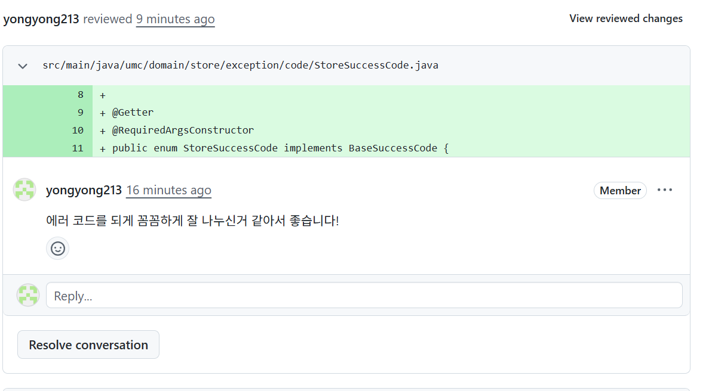
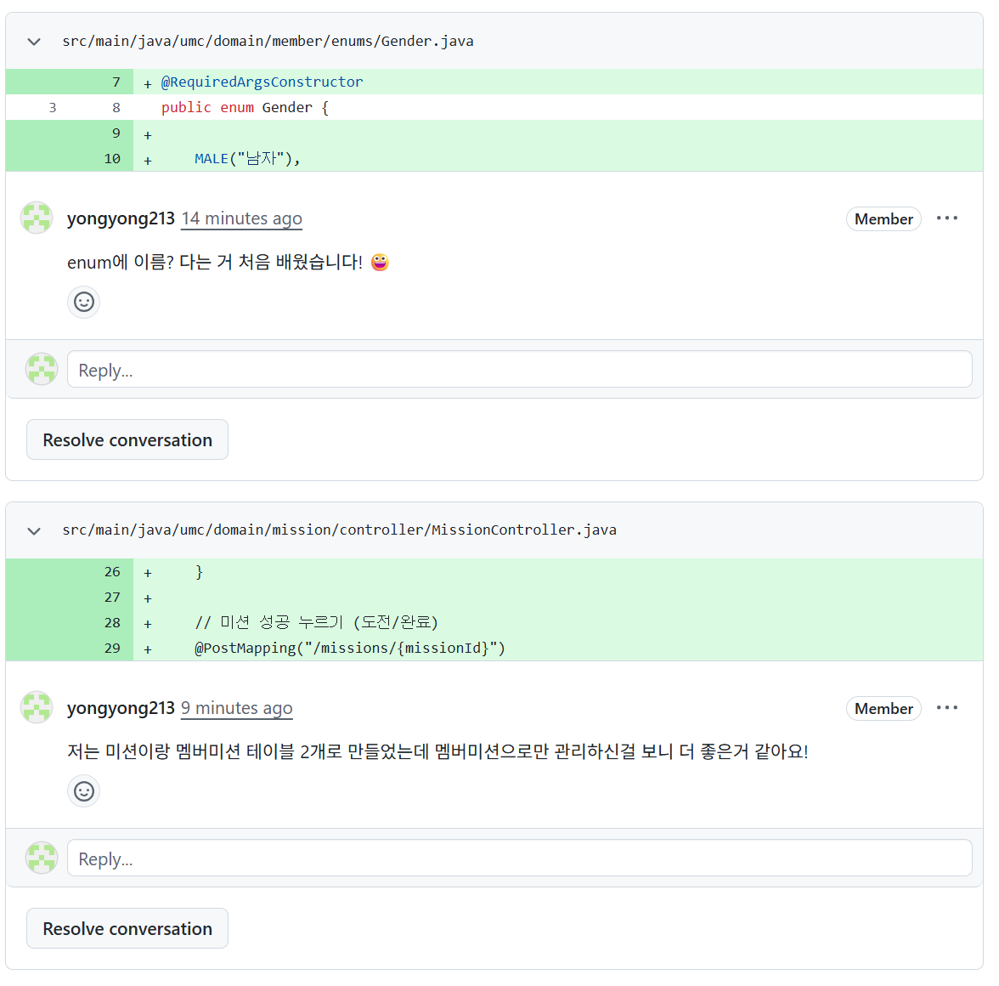
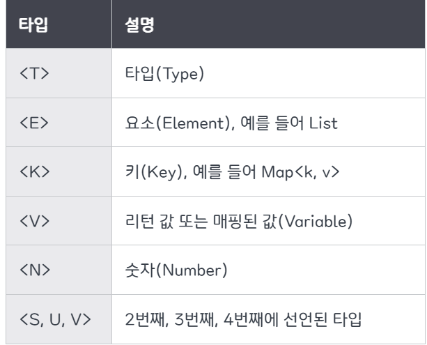

- 피어리뷰 (주니꺼)



    에러 코드를 꼼꼼하게 나눈 것이 좋았고, Enum 타입에 가독성을 높이기 위해 이름을 붙힐 수 있는 것을 처음 알게 되었다.
    api 나눈것도 깔끔하게 잘 나뉜거 같아 좋았다. 

---


- 빌더패턴이란?
    
    복잡한 객체의 생성 과정과 표현 방법을 분리하여, 동일한 생성 절차에서 서로 다른 표현 결과를 만들 수 있게 하는 패턴이다.
    
    → 생성자 인자가 많아질수록 가독성이 떨어지고, 헷갈려지기 때문에 빌더 패턴으로 해결
    
    생성자
    
    ```c
    Member member = new Member(1L, "yongyong", "seoul", "...", "...", ......)
    ```
    
    빌더 패턴
    
    ```c
    Member member = Member.builder()
    			.address("seoul")
          .id(1L)
          .age(24)
          . //...
          .name("yongyong").build();
    ```
    
    ```c
    public class Member {
        private Long id;
        private String name;
        private String address;
        
        
        //생성자. Member로 변환하는 build 메소드에서 사용
        public Member(Builder builder) {
            this.id=builder.id;
            this.name=builder.name;
            this.address=builder.address;
    
        }
        
        //외부에서 Builder를 생성
        public static Builder builder() {
            return new Builder();
        }
    
        public static class Builder{
            private Long id;
            private String name;
            private String address;
    
            public Builder id(Long id) {
                this.id=id;
                return this;
            }
            public Builder name(String name) {
                this.name=name;
                return this;
            }
            public Builder address(String address) {
                this.address=address;
                return this;
            }
    
    				//Member로 변환
            public Member build() { 
                return new Member(this);
            }
        }
    }
    ```
    
    빌더 호출 → 메서드 체이닝 → build() 메서드 호출→멤버생성자→멤버 객체가 builder의 값 복사
    
- record vs static class
    - **static class**
        
        필드에 final 안붙히면 변경 가능( 유연성 )
        
        Getter에서 로직을 추가, 생성자에서 복잡한 유효성 검사 등 커스터마이징 유리
        
        상속 가능
        
        Getter, equals, hashCode 등 직접 작성 (보일러플레이트)
        
        필드가 바뀌면 유지보수 어려움
        
        → 빌더 패턴처럼 클래스를 만드는 과정이나 복잡한 로직을 분리하고 싶을 때 사용
        
        ```c
        public class MemberDTO {
            private final Long id;
            private fianl String name;
            private final String address;
        
            public Long getId() {
                return id;
            }
        
            public String getName() {
                return name;
            }
        
            public String getAddress() {
                return address;
            }
        
            public TestClassDto(Long id, String name, String address) {
                this.id = id;
                this.name = name;
                this.address = address;
            }
        }
        ```
        
    - recode
        
        “데이터를 전달하기 위한” 클래스
        
        모든 필드가 final인 불변 데이터 
        
        static의 보일러플레이트 코드 자동 생성
        
        → DTO나 데이터베이스에서 조회한 값을 담아둘 때 사용 (안전)
        
        ```c
        public record MemberDTO(Long id, String name, String email){
        }
        ```
        
- 제네릭이란?
    
    클래스 내부에서 사용할 데이터 타입을 외부에서 정하는 것으로, 데이터 타입을 확정 짓지 않고, 사용할 때 파라미터로 지정한다.
    
    
    **장점**
    
    - 컴파일 타임에 타입 검사를 하여 예외 방지
        
        제네릭 대신 오브젝트 타입을 사용하게 되면 아무 데이터나 다 들어갈 수 있기 때문에 위험
        
    - 불필요한 캐스팅 없앰
        
        미리 탕비을 지정, 제한해 놓기 때문에 형 변환의 번거로움이 사라진다.
        
        (object면 일일히 다운캐스팅을 해줬어야 함)
        
        ```c
        FruitBox<Apple> box = new FruitBox<>(arr)
        
        Apple apple = box.getFruit(0);
        Apple apple = box.getFruit(1);
        Apple apple = box.getFruit(2);
        ```
        
    
    **주의!**
    
    - 제네릭 타입의 객체는 생성이 불가
    - static 멤버에 제네릭 타입이 올 수 없음
    
- @RestControllerAdvice이란?
    
    예외처리를 try-catch로 처리하게 되면 불필요한 중복 코드들이 많아지고 가독성이 떨어진다.
    
    이러한 문제를 해결하기 위해 `@ControllerAdvice` 와 `@RestControllerAdvice`  를 사용한다.
    
    `@ControllerAdvice`는 @ExceptionHandler, @ModelAttribute, @InitBinder가 적용된 메소드를 컨트롤러 단에서 잡아서 처리하는 것이다.
    
    `@RestControllerAdvice` 는 @ControllerAdvice와 @ResponseBody를 합친 어노테이션으로 @ControllerAdvice의 역할을 수행하고, @ResponseBody를 통해 응답을 JSON으로 리턴한다.
    
    내부적으로 AOP를 적용하여 동작한다. 모든 컨트롤러의 실행을 가져와서, 예외가 발생하는 순간 해당 예외를 처리하는 전용 핸들러가 처리하게 한다.
    
    → 특정 컨트롤러 하나가 아니라 프로젝트 전체의 예외를 한 곳에서 관리, 일관된 응답 구조 유지
    
    + 특정 패키지나 특정 어노테이션이 붙은 컨트롤러만 감시하도록 범위를 좁힐 수도 있고, 여러 개의 advice 클래스가 있을 경우 @Order 어노테이션으로 순서를 정할 수도 있다.
    
    **장점**
    
    - 중복 코드 감소
    - 응답 규격화
    - 유지보수 용이
    
- Optional이란?
    
    null일 수도 있는 객체를 감싸는 일종의 Wrapper 클래스이다.
    
    null을 반환하면 오류가 발생할 가능성이 매우 높은 경우에 ‘결과 없음’을 명확히 드러내기 위해 만들어짐.
    
    ```c
    String name = Optional.ofNullable(userName).orElse("익명")
    ```
    
    `orElse` : 파라미터로 값을 받는다. 얘는 값을 미리 만들어 둠.
    
    `orElseGet` : 파라미터로 함수를 받는다. optional 안의 값이 비어있을 때만 함수를 실행하여 값을 만들기 때문에 값이 없을 때만 실행된다. 새로운 객체를 생성하거나 DB 조회 등 비용이 크다면 orElseGet을 사용!
    
    주의
    
    - Optional 변수에 Null 할당하지 말기 (optional 변수 자체가 null인지 다시 확인해야 함)
    - 생성자, 수정자, 메소드 파라미터 등으로 Optional 넘기지 말기 (이것도 optional 자체가 null인지 다시 이중 체크해야 함)
    - 반환 타입으로만 사용하기 (필드로 쓸 때 직렬화를 지원하지 않음)