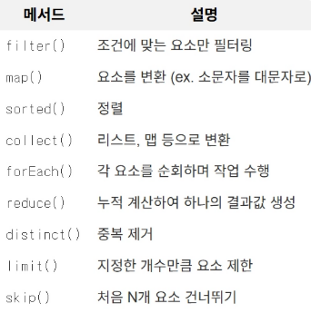

- Page와 Slice
    
    **Slice**
    
    전체 개수를 세지 않고, 다음 페이지가 있는지 확인하는 방식으로 무한 스크롤 구현에서 사용된다. ( hasNext 여부만 반환 됨 )
    
    전체 페이지 수, 전체 element 수가 필요 없을 때 사용
    
    사용자가 10개를 요청하면 내부적으로 10+1개를 조회하고, 만약 11번째가 조회된다면, 다음 페이지가 있다고 판단하고, 10개를 반환한다.
    
    장점
    
    - count 쿼리를 사용하지 않기 때문에 데이터가 대량으로 있을 때 성능이 좋다.
    - DB 부하를 최소화하고, 빠르다.
    - 데이터 양과 관계없이 성능이 일정하다.
    
    단점
    
    - 전체 데이터 양이나 마지막 페이지가 어디인지 알 수 없다.
    - 특정 페이지로 건너뛰는 기능을 구현하기 어렵다.
    
    **Page**
    
    전체 데이터 양을 기반으로 전체 페이지 수를 계산하여 제공하는 방식
    
    데이터를 가져오는 쿼리와 전체 개수를 세는 count 쿼리를 각각 한 번씩, 총 두 번 실행한다.
    
    Page는 Slice를 상속 받는다. 조회 쿼리 후 전체 데이터 개수를 조회하는 count 쿼리가 한번 더 실행됨.
    
    장점
    
    - 사용자가 전체 데이터가 얼마나 되는지 정확히 알 수 있다.
    - 특정 페이지로 이동할 수 있다.
    
    단점
    
    - 데이터가 굉장히 많아지면 count 쿼리가 무거워지고, 속도가 느려진다.
    
- Java stream API
    
    **Java stream API :** 컬렉션을 직관적이고, 함수형 스타일로 다룰 수 있게 도와준다. 컬렉션에 저장된 요소들을 선언적으로 처리할 수 있게 함. 
    
    기존 for 루프나 Iterator를 사용한 방식보다 간결하고, 가독성이 좋다.
    
    또한 병렬 처리를 쉽게 적용할 수 있어 성능 최적화에 도움을 준다.
    
    **주요 특징**
    
    - 연속적인 처리 가능
        - 한 번에 여러 연산을 조합해서 사용 가능함
    - 내부 반복
        - for문을 사용하지 않고도 데이터 처리가 가능하다.
    - 중간 연산과 최종 연산 구분
        - 중간 연산은 여러 개 연결할 수 있고, 최종 연산이 실행될 때 실제 데이터가 처리 됨
    - 불변성 유지
        - 원본 데이터를 변경하지 않고, 새로운 스트림을 생성하여 처리함.
    - 지연 연산 (Lazy Evaluation)
        - 최종 연산이 호출될 때까지 중간 연산이 수행되지 않는다.
    
    **주요 메서드**
    
    
    
    **사용 예시**
    
    ```sql
    public class StreamExample {
        public static void main(String[] args) {
            List<String> names = Arrays.asList("apple", "banana", "cherry", "avocado");
    
            List<String> filteredNames = names.stream() // 생성
    		        // 중간 연산
                .filter(name -> name.startsWith("a")) // a로 시작하는 이름 필터링
                .map(String::toUpperCase) // 대문자로 변환
                // 최종 연산 ex) collect, forEach, count
                .collect(Collectors.toList()); // 리스트로
    
            System.out.println(filteredNames);
        }
    }
    ```
    
     병렬 처리
    
    ```sql
    import java.util.stream.IntStream;
    
    public class ParallelStreamExample {
        public static void main(String[] args) {
            System.out.println("\nParallel Stream:");
            IntStream.range(1, 10).parallel().forEach(i -> System.out.print(i + " "));
        }
    }
    ```
    
    → 일반적으로 for 루프가 속도가 더 빠르고, stream api는 내부 로직을 수행하는 오버헤드가 있기 때문에 데이터 크기가 크고, 멀티코어 활용 가능한 경우엔 병렬 처리, 아니면 for문이 유리
    
    **장점**
    
    - 가독성
    - 병렬 처리
        - 멀티스레드 같이 복잡한 로직 없이도 데이터를 병령로 빠르게 처리할 수 있다.
    - NullPointerException 같은 예외 방지
- 객체 그래프 탐색
    
    **객체 그래프 탐색** : 객체들이 서로 참조를 통해 연결 되어 있는 상태에서, 참조를 따라가며 원하는 객체를 탐색하는 것 
    
    ( A를 알 때 A와 연관된 B를 찾고, 다시 B와 관련 된 C를 찾는다)
    
    member가 order를 가지고, order는 orderItem, orderItem은 item을 가질 때
    
    ```sql
    String memberName = order.getMember().getName()
    
    //0번 orderItem의 itemName
    String itemName = order.getOrderItems.get(0).getItem.getName()
    ```
    
    **순수 SQL과 비교**
    
    - 순수 SQL은 실행되기 전까지 연관 관계를 알 수 없고, 처음에 JOIN을 안했다면, 나중에 다시 추가적인 쿼리를 보내야 한다.
    - 또한 순수 SQL은 불필요한 데이터 등까지 받아와야 하기 때문에 성능면에서 안좋다.
    - 순수 SQL과 달리 객체 그래프 탐색은 한 번 가져온 엔티티를 캐시에 저장하여 더욱 효율적이다.
    
    **주의**
    
    “어디까지 탐색이 가능한가”에 대한 범위 결정 문제가 있다.
    
    만약 `SELECT * FROM orders WHERE id = 1` 이라는 쿼리로, order 객체만 만들었는데, `order.getMember()` 를 호출하게 되면 null이 반환 된다.
    
    SQL로 조회한 범위 이상으로 넘어가면 데이터가 없어서 에러나, 로직이 깨진다.
    
- @Valid vs @Validated
    
    **@Valid** : 빈 검증기(Been Validator)를 이용해 객체의 제약 조건을 검증하도록 하는 어노테이션
    
    ```sql
    public interface OnCreate {}
    public interface OnUpdate {}
    
    public class UserDto  {
    
    	@NotNull
    	private String id;
    	
    	@Min(20)
    	private int age;
    }
    ```
    
    ```sql
    @PostMapping("/user/add")
    public void addUser(@RequestBody @Valid UserDto dto){
    	//...
    }
    ```
    
    →컨트롤러의 메서드에 @Valid 붙혀서 유효성 검사
    
    **기본적으로 컨트롤러에서만 동작**한다.
    
    **@Validated** : ****입력 파라미터 유효성 검증은 최대한 컨트롤러에서 처리하지만, 다른 곳에서 파라미터 검증해야 하는 경우, **AOP 기반으로 메소드의 요청을 가로채 유효성 검증을 해준다**
    
    ```sql
    public interface OnCreate {}
    public interface OnUpdate {}
    
    public class UserDto  {
    
    	@NotNull(groups = OnCreate.class)
    	private String id;
    	
    	@Min(20)
    	private int age;
    }
    ```
    
    ```sql
    @PostMapping("/user/add")
    public void addUser(@Validated(OnCreate.class) @RequestBody UserDto dto){
    	//...
    }
    ```
    
    서비스 계층에서 특정 파라미터를 검증해야 하거나, 상황에 따른 다른 규칙을 적용해야 할 때 사용.
    
    **정리**
    
    - 기본은 `@Valid` 사용
        - 단순 DTO 하나 검증 등
    - 그룹별 검증이나 서비스 계층에서의 검증에서 `@Validated` 사용