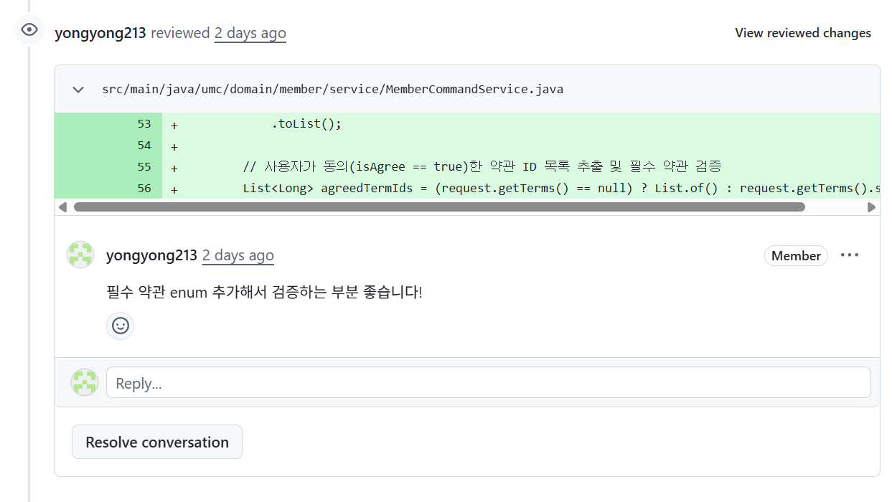

- 피어리뷰 (주니꺼)
    필수 약관까지 고려하여 검증한 부분이 좋았다
    
- Spring Security가 무엇인가?
    
    **Spring Security :** 스프링 프레임워크 기반 애플리케이션의 보안을 담당하는 하위 프레임워크 
    
    요청이 Dispatcher Servlet으로 가기 전에 Filter 단에서 가로채 인증과 인가를 대신 처리해 줌.
    
    **핵심 개념**
    
    - 인증
        - 시스템을 사용하려는 사용자가 누구인지 사용자의 신원을 검증하는 과정
    - 인가
        - 인증된 사용자가 특정 리소스에 접근하거나, 특정 기능을 수행할 수 있는 권한이 있는지 허가하는 과정
        - 인증이 끝난 후에 인가가 진행
    
    **특징**
    
    - 복잡한 로직 없이도 어노테이션으로 설정 가능
    - 세션 기반 인증
    - 필터 기반 동작
    
    **필터 기반 동작**
    
    클라이언트가 서버로 요청을 보낼 때 서블릿 필터에 도달하기 전에 요청을 가로채서 여러 필터들을 순차적으로 거치며 인증과 인가를 처리하는 구조
    
    ( 세션 조회, 로그인, 예외처리 등등 ) 
    
    **기능**
    
    - 폼 로그인, 소셜 로그인, JWT 등 여러 인증 방식 지원
    - CSRF 공격 차단
    - 어노테이션 기반의 권한 제어
        - `@PreAuthorize("hasRole('ADMIN')")` 같이 특정 권한을 가진 사용자만 메소드를 사용할 수 있도록 간단한 제어 가능
        - 컨트롤러 메서드에 어노테이션 추가
        
        ```sql
        @EnableWebSecurity
        @Configuration
        @EnableMethodSecurity //추가
        public class SecurityConfig {
            // ...
        }
        ```
        
        ```sql
        @PostMapping("/mission/issue")
            @PreAuthorize("hasRole('ADMIN')")
            public ApiResponse<String> createMission() {
                return ApiResponse.onSuccess("(관리자 전용)");
            }
        ```
        
    
- 인증(Authentication)vs 인가(Authorization)
    - 인증
        - 시스템을 사용하려는 사용자가 누구인지 사용자의 신원을 검증하는 과정
            - 아이디 비밀번호, OTP, 생체 인식, 소셜 로그인 등
            - `401 Unauthorized`  에 해당
    - 인가
        - 인증된 사용자가 특정 리소스에 접근하거나, 특정 기능을 수행할 수 있는 권한이 있는지 허가하는 과정
        - 인증이 끝난 후에 인가가 진행
            - 사용자의 역할 확인 (일반 유저인지 abmin인지) 등
            - `403 Forbidden`  권한이 없는거
- Stateful vs Stateless
    
    **Stateful (상태 유지)**
    
    - 서버가 클라이언트의 상태를 보존
    - 서버가 클라이언트의 이전 상태를 기억하며, 그 상태를 바탕으로 다음 요청을 처리
        - 로그인 해두면 페이지를 이동해도 풀리지 않고 유지
    - 브라우저의 쿠키나 서버의 세션 메모리에 저장
    - 예시 : TCP 프로토콜, 세션 기반 로그인
    
    **장점 :** 클라이언트가 매 요청마다 자기 정보를 보낼 필요가 없어 통신 데이터가 단순
    
    **단점 :** 클라이언트가 늘어날수록 서버가 기억할게 많아져 서버 부담이 커지고, 서버를 여러 대 쓰게 되면 유저 상태를 서버끼리도 공유해야 돼서 동기화 문제 발생
    
    **Stateless (무상태)**
    
    - 서버가 클라이언트의 이전 상태를 기억하기 않는 방식
    - 모든 요청이 독립적이라, 필요한 모든 정보를 다 담아서 보내야 함.
    - 예시 : HTTP 프로토콜, REST API, JWT 기반 인증
    
    **장점 :** 서버가 상태를 보관하지 않아 서버 메모리 부담이 없다. 확장성이 뛰어나다. (서버 늘려도 독립적인 처리)
    
    **단점 :** 클라이언트의 요청 전송 데이터량이 커짐