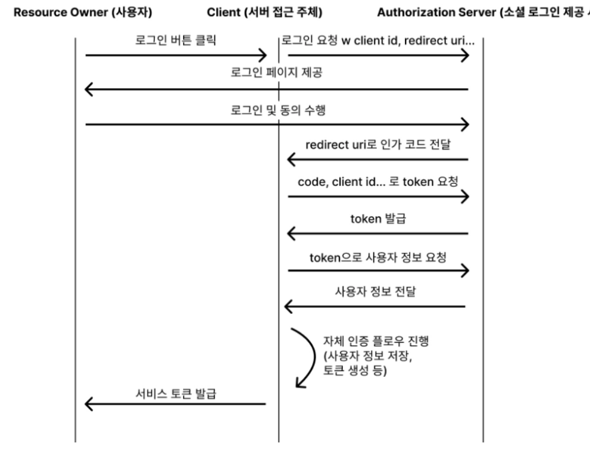

- 세션과 토큰의 차이는?
    
    **세션** : 로그인 정보를 서버에 저장하고, 클라이언트는 세션 ID만 가지고 있는 방식. 
    
    클라이언트의 Request에 세션 ID가 담긴 쿠키를 같이 전달한다.
    
    **장점**
    
    - 세션 ID만 클라이언트 쪽에서 사용하므로 네트워크 트래픽이 적다.
    - 서버에서 세션 정보를 관리하므로, 보안 측면에서 조금 더 유리하다.
    
    **단점**
    
    - 사용자가 많아지면 서버의 메모리를 많이 차지하게 되어 서버 부담이 커진다.
    - 서버를 확장하게 된다면, 서버들끼리 세션을 공유하기 위한 추가 작업이 필요하다.
    
    **토큰** : 클라이언트의 요청마다 사용자의 자격 증명 정보를 보내는 것
    
    사용자가 로그인하면 서버는 유저 정보와 서버만 아는 비밀키로 서명한 토큰을 발급해서 클라이언트에게 넘겨준다.
    
    서버는 이 토큰을 따로 저장하지 않고, 클라이언트는 요청을 보낼 때마다 HTTP 헤더에 토큰을 실어 보내고, 서버는 자신이 서명한 것이 맞는지 유효성 검사만 진행한다.
    
    **장점** 
    
    - 서버 부담이 거의 없다.
    - 확장성도 뛰어나다.
    
    **단점**
    
    - 한 번 토큰이 발급되면, 토큰의 수명이 다할 때까지 무효화하기 어렵다.
    
- **엑세스 토큰과 리프레시 토큰이란?**
    
    access token이란 서버에 인가를 증명하는 암호화된 토큰으로 HTTP 요청 헤더에 실어 보낸다. 
    
    access token 발급할 때는 유효기간을 정해서 발급하는데, 유효 기간이 지날 때마다 다시 로그인을 해야한다.
    
    그런데 access token 유효 기간을 길게 설정한다면, 토큰이 탈취 당했을 때, 제 3자가 사용자인 척 요청을 할 수 있다는 위험이 있다
    
    → refresh token 도입으로 해결
    
    access token은 사용자를 인증할 때 사용한다면, refresh token은 access token을 재발급 받을 때 사용한다.
    
    → access token을 탈취 당했을 때 위험을 줄이기 위해 유효 기간을 짧게 설정하고, refresh token으로 재발급한다.
    
    +
    
    refresh token을 탈취당하면 access token을 계속해서 발급 받을 수 있는 문제
    
    **RTR**
    
    서버가 refresh token을 발급할 때 DB에 refresh token을 저장해두고, 유저 refresh token으로 access token을 재발급 받을 때 refresh token도 재발급해서 같이 넘겨준다. 
    
- OAuth 1.0과 OAuth 2.0의 차이는?
    
    **OAuth 1.0** : 요청을 보낼 때마다 모든 데이터를 암호화하여 ‘디지털 서명’을 만들어 같이 보냄
    
    → 단점 : 서버와 클라이언트 양쪽에서 서명을 매번 계산하고 검증해야 함.
    
    **OAuth 2.0** : 복잡한 서명을 버리고, 통신 자체를 HTTPS로 암호화 함.
    
    → 암호화 된 통로에서 엑세스 토큰만 주고 받음.
    
    **차이점** 
    
    - refresh token을 사용한 토큰 재발급
    - 여러 인증 흐름 지원 ( 서버 로그인, 클라이언트 로그인 )
    - 다양한 환경에서 사용 가능
    
    **주요 역할**
    
    1. Resource Owner
        
        : 리소스 소유자로 사용자의 계정
        
    2. Client
        
        : 사용자의 권한을 위임받아 보호된 리소스에 접근
        
    3. Authorization Server
        
        : 클라이언트에게 Authorization Code 또는 Token을 발급하는 서버
        
    4. Resource Server
        
        : 데이터를 제공하는 서버.
        
        
    
    흐름
    
    1. 클라이언트가 권한 부여 요청을 위해 사용자를 Authorization Server로 리다이렉션
    2. 사용자가 로그인 및 권한 승인
    3. Authorization Server는 **Authorization Code**를 클라이언트로 전달
    4. 클라이언트가 Authorization Code로 **Access Token** (및 Optional Refresh Token) 요청
    5. 클라이언트는 발급 받은 Access Token으로 Resource Server에 요청하여 보호된 리소스를 접근