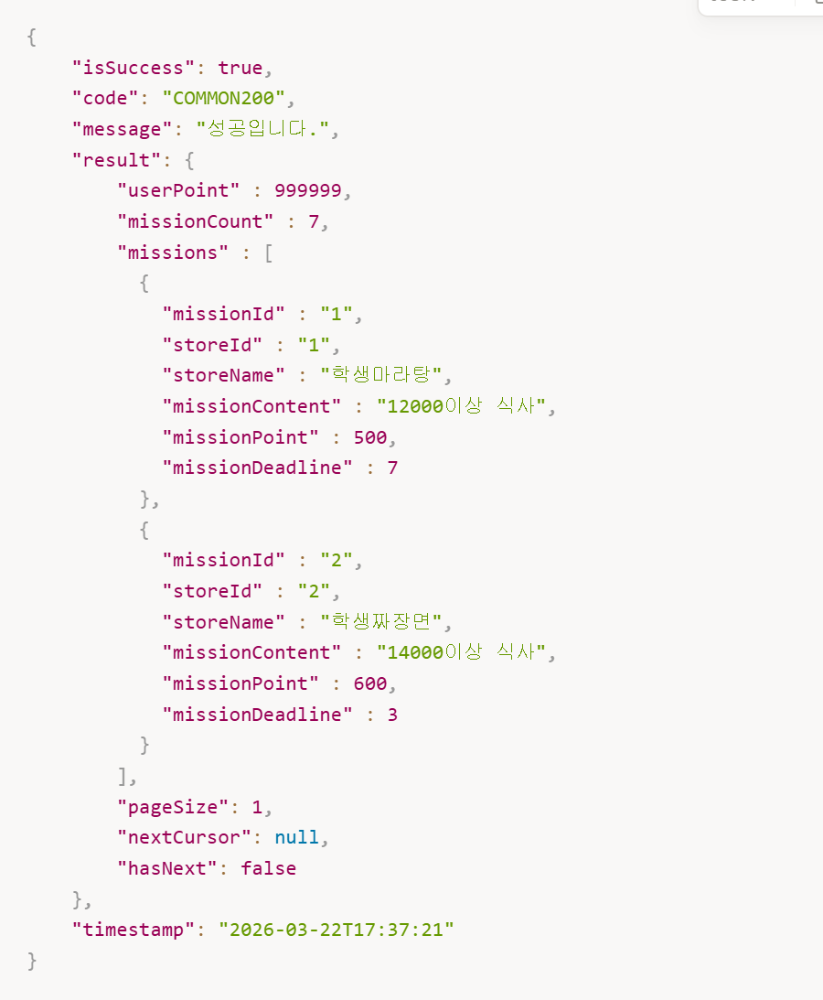

### 피어리뷰(주니꺼)


api 명세서 작성할 때, 페이징을 처음 접해봤는데 주니의 워크북을 보고 페이징에 관한 정보를 넘겨야 한다는 것을 알 수 있었다.

---

## 홈화면

**API Endpoint:** /api/v1/home

**Method:** GET

**Request Header:** Authorization: Bearer {token}

**Query Parameter**

```sql
/api/v1/home?regionName=안암동
```

**Path Variable:** X

**Request Body**

```sql

```

**Response Body**

```sql
{
  "isSuccess": true,
  "code": "HOME200",
  "message": "홈 화면이 성공적으로 조회되었습니다.",
  "result": {
    "currentRegion": "안암동",
    "successMission": 7,
    "alarmCount": 99999,
    "missions": {
	    "content": [
		    {
		      "missionId": 1,
		      "storeName": "반이학생마라탕",
		      "missionContent": "10000원 이상의 식사시",
		      "missionPoint": 500,
		      "missionDeadline": 7
		    },
		    {
		      "missionId": 2,
		      "storeName": "반이학생마라탕",
		      "missionContent": "10000원 이상의 식사시",
		      "missionPoint": 500,
		      "missionDeadline": 7
		    },
	    ],
	    "pageable":{
		    "pageNumber": 0,
		    "pageSize": 10
		  },
		  "isFirst": true,
		  "isLast": false,
		  "hasNext": true
		}
  }
}
```

## 마이페이지 리뷰 작성

**API Endpoint:** /api/v1/stores/{storeId}/reviews

**Method:** POST

**Request Header:** 

Authorization: Bearer {token}

Content-type: multipart/form-data

**Query Parameter:** X

**Path Variable:** 

```sql
{
	"storeId": 1
}
```

**Request Body**

```sql
{
  "star": 5,
  "content": "맛있어여ㅕ",
  "photoUrl": "~~~"
}
```

**Response Body**

```bnf
{
  "isSuccess": true,
  "code": "USER_MISSION200",
  "message": "내 미션이 성공적으로 조회되었습니다.",
  "result": {
    "myMissions": [
      {
        "userMissionId": 1,
        "storeName": "반이학생마라탕",
        "missionContent": "10000원 이상의 식사시",
        "missionPoint": 500,
        "missionDeadline": 7
      },
      {
        "userMissionId": 2,
        "storeName": "반이학생마라탕",
        "missionContent": "10000원 이상의 식사시",
        "missionPoint": 500,
        "missionDeadline": 7
      }
    ],
    "listSize": 1,
    "hasNext": false,
    "nextCursor": null
  }
}
```

## 미션 목록 조회

**API Endpoint:** /api/v1/users/me/missions

**Method:** GET

**Request Header:** Authorization: Bearer {token}

**Query Parameter**

```sql
/api/v1/users/me/missions?isComplete=true
```

**Path Variable:** X

**Request Body**

```sql
필요없음
```

**Response Body**

```sql
{
  "isSuccess": true,
  "code": "USER_MISSION200",
  "message": "내 미션이 성공적으로 조회되었습니다.",
  "result": {
    "myMissions": [
	    {
	      "userMissionId": 1,
	      "storeName": "반이학생마라탕",
	      "missionContent": "10000원 이상의 식사시",
	      "missionPoint": 500,
	      "missionDeadline": 7
	    },
	    {
	      "userMissionId": 2,
	      "storeName": "반이학생마라탕",
	      "missionContent": "10000원 이상의 식사시",
	      "missionPoint": 500,
	      "missionDeadline": 7
	    }
    ]
  }
}
```

## 미션 성공 누르기

**API Endpoint:** /api/v1/users/user-missions/{user_mission_id}

**Method:** PATCH

**Request Header:** Authorization: Bearer {token}

**Query Parameter**

```sql
필요없음
```

**Path Variable**

```sql
{
	"userMissionId": 1
}
```

**Request Body**

```sql
필요없음
```

**Response Body**

```sql
{
  "isSuccess": true,
  "code": "USER_MISSION_REQUEST200",
  "message": "내 미션 완료 요청 완료",
  "result": {
    "userMissionId": 1
  }
}
```

## 회원가입하기

**API Endpoint:** /api/v1/auth/signup

**Method:** POST

**Request Header:** content type: application/json 

**Query Parameter**

```sql
필요없
```

**Path Variable:** X

**Request Body**

```sql
{
	"email": "ddd@naver.com",
  "password": "1234",
  "name": "레오",
  "gender": "MALE",
  "birth": "2003-12-02",
  "address": "경기도 안산시",
  "agreedTerms": [1, 3],
  "userFoods": [0, 1, 3]
}
```

**Response Body**

```sql
{
  "isSuccess": true,
  "code": "AUTH201",
  "message": "회원가입 완료.",
  "result": {
		"email": "ddd@naver.com",
	  "name": "레오"
	}
}
```